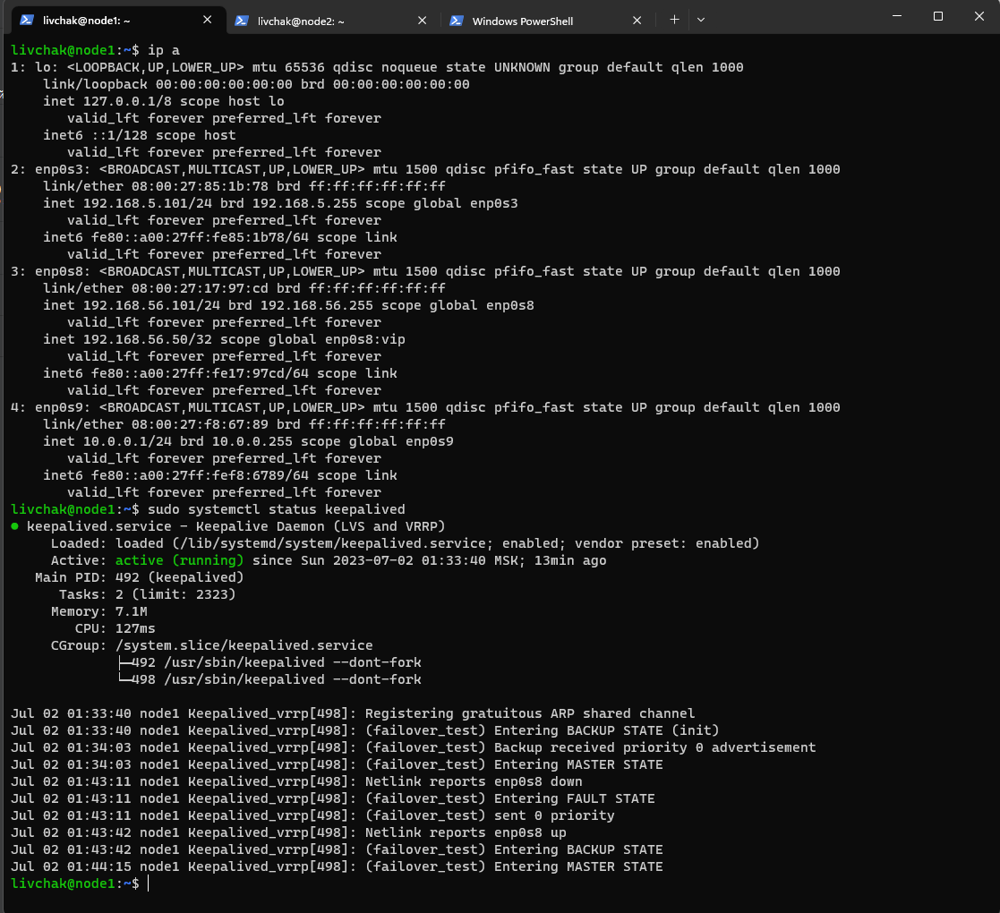
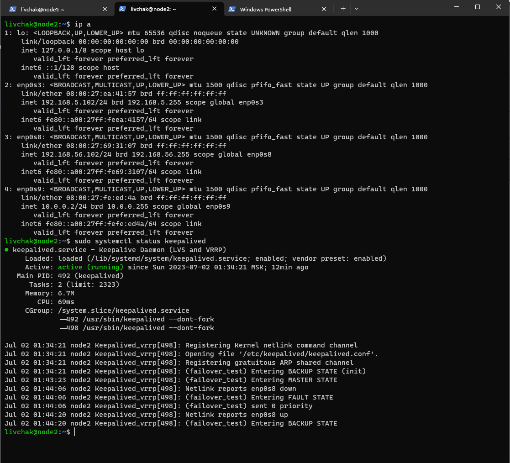
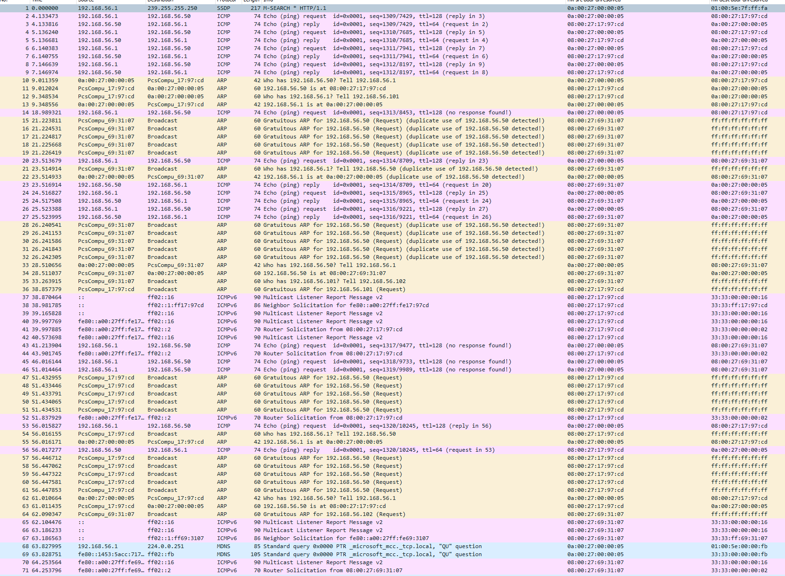

# Домашнее задание к занятию "`10-01hw`" - `Ливчак Сергей`


---

### Задание 1

node1.
```vrrp_instance failover_test {
state MASTER
interface enp0s8
virtual_router_id 10
priority 110
advert_int 4
authentication {
auth_type AH
auth_pass 1111
}
unicast_peer {
192.168.56.102
}
virtual_ipaddress {
192.168.56.50 dev enp0s8 label enp0s8:vip
}
}
```
**Скриншот 1-1_1** 



node2.
```
vrrp_instance failover_test {
state BACKUP
interface enp0s8
virtual_router_id 10
priority 110
advert_int 4
authentication {
auth_type AH
auth_pass 1111
}
unicast_peer {
192.168.56.101
}
virtual_ipaddress {
192.168.56.50 dev enp0s8 label enp0s8:vip
}
}
```
**Скриншот 1-2_1** 

---


## Дополнительные задания (со звездочкой*)


### Задание 2*

`Захват пакетов с хостовой машины windows `

1. `работают обе ноды пинг пошёл с хоста 00:00:05 и пинг приняла нода1 17:97:cd`
2. `тушу интерфейс на ноде1 `
3. `хост 00:00:05 arp запросом начинает искать 192.168.56.50`
4. `какое-то количество широковещательных запросов и тут начинает отвечать нода2 69:31:07`
5. `тушу нода2 69:31:07`
6. `поднимаю интерфейс на ноде1 17:97:cd и мы видим мультиаст запросы`
7. `на временной отметке 56,017277 мы снова получаем ответ от нода1 17:97:cd`

**Скриншот 1-2_1** 


`при попытке перехватить пакеты посылаемые с третьей vm wireshark запущенный на хостовой windows ни чего не увидел`
